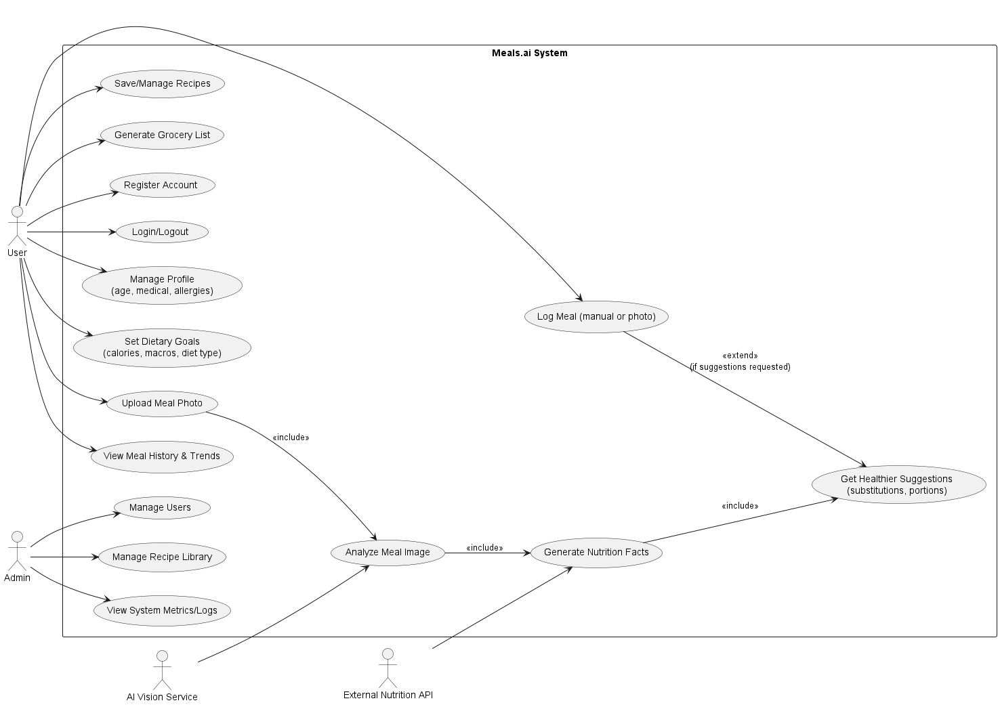
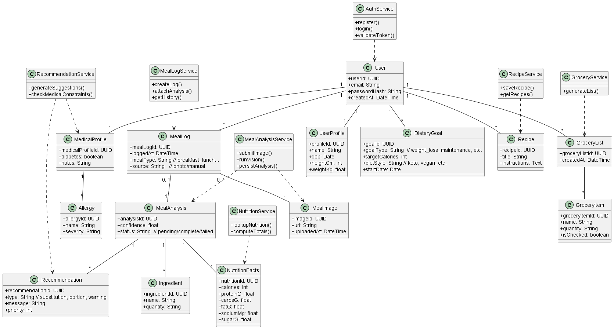
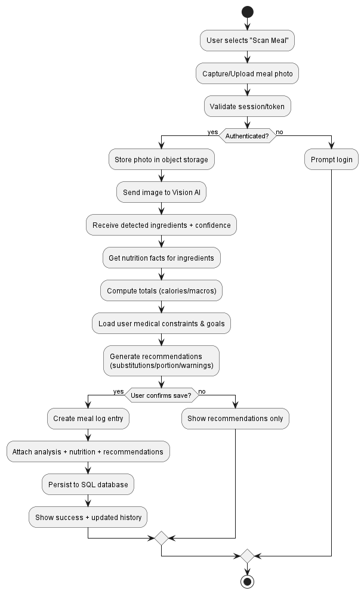
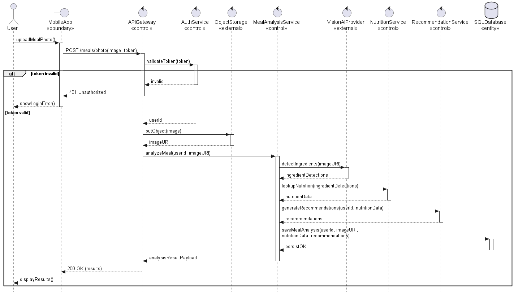
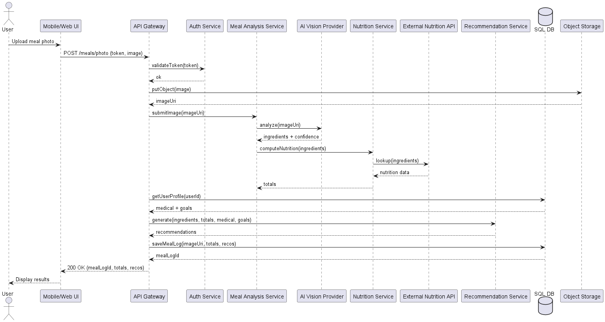
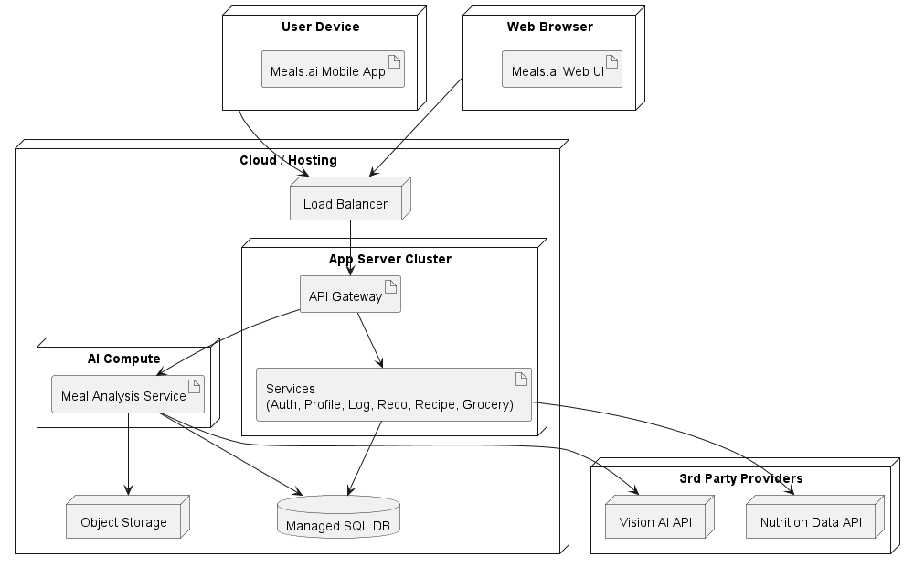
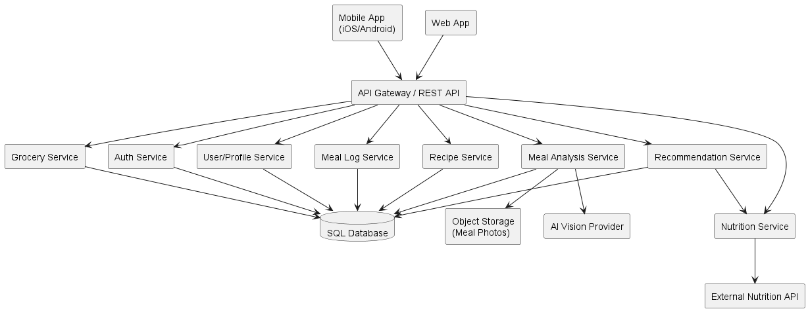

### UML - Use Case Diagram

### UML - Class Diagram

### UML - Activity Diagram

### UML - Sequence Diagram

### UML - Communication Diagram

### UML - Deployment Diagram

### UML - Component Diagram

### DFD - Level 0 Diagram

### DFD - Level 1 Diagram

### DFD - Level 2 Diagram

