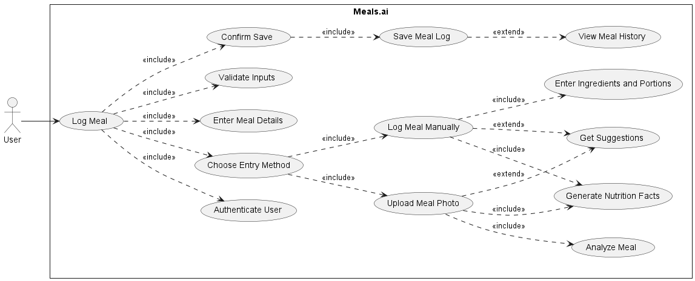
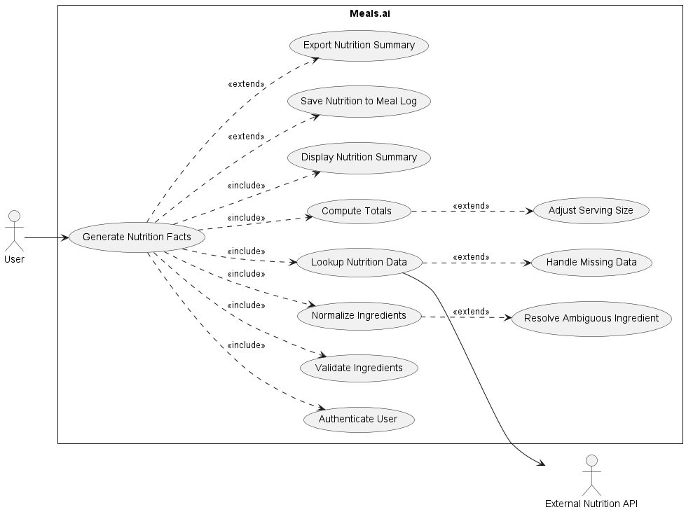
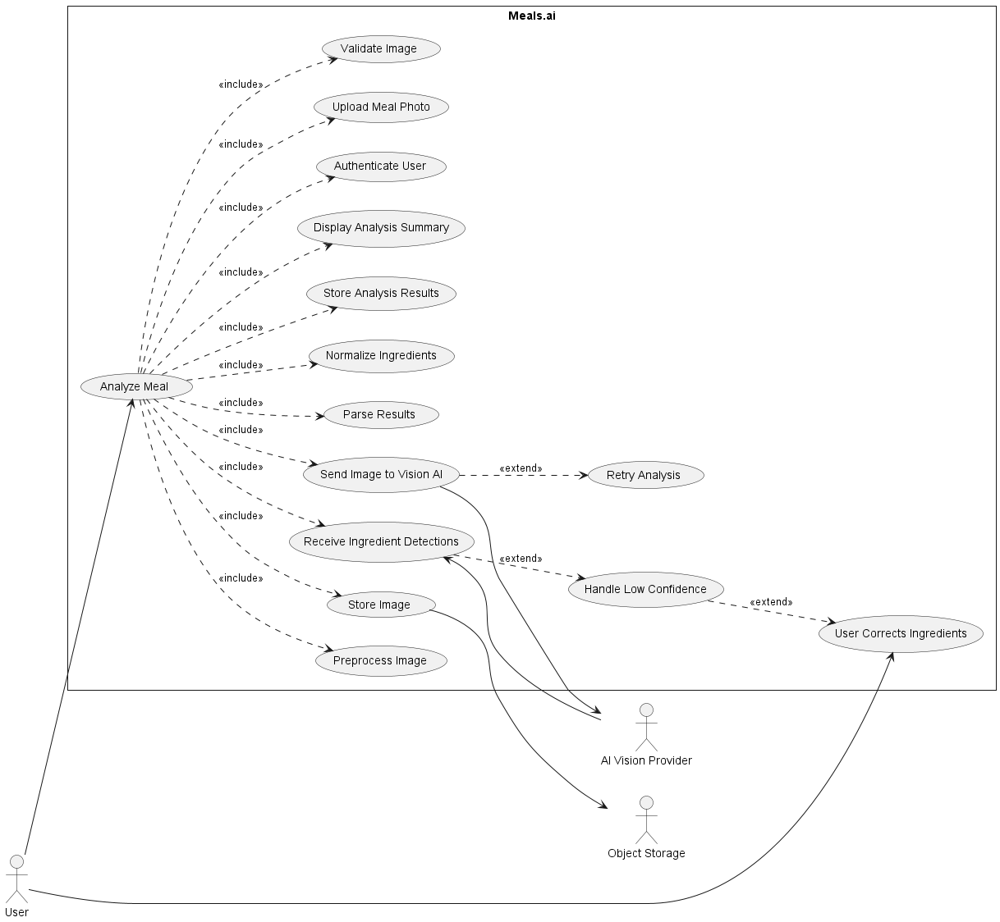
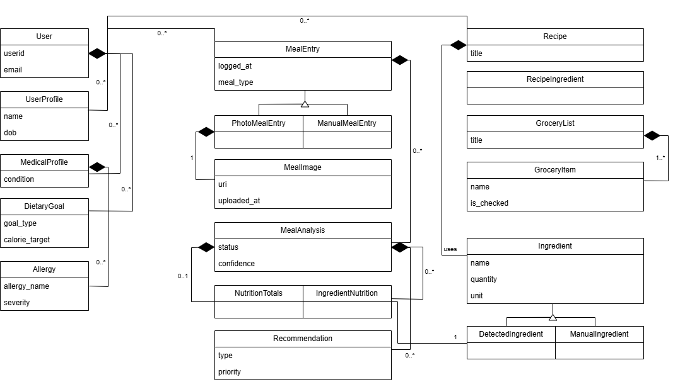
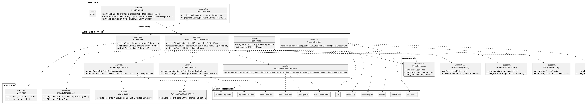
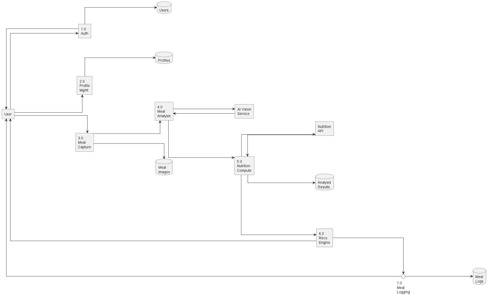
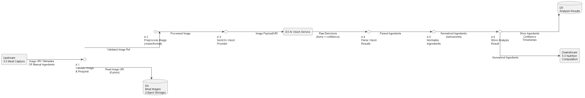

### UML - Use Case 1 Diagram - Log Meal

### UML - Use Case 2 Diagram - Generate Nutrition Facts

### UML - Use Case 3 Diagram - Analyze Meals

### UML - Class Diagram 1 - Domain Model

### UML - Class Diagram 1 - Application/Implementation

### UML - Activity Diagram

### UML - Sequence Diagram

### UML - Communication Diagram

### UML - Deployment Diagram

### UML - Component Diagram

### DFD - Level 0 Diagram

### DFD - Level 1 Diagram

### DFD - Level 2 Diagram

