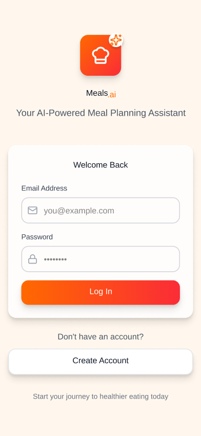
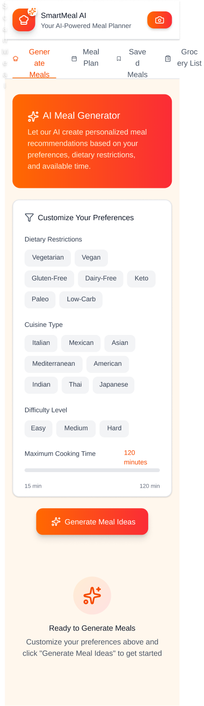
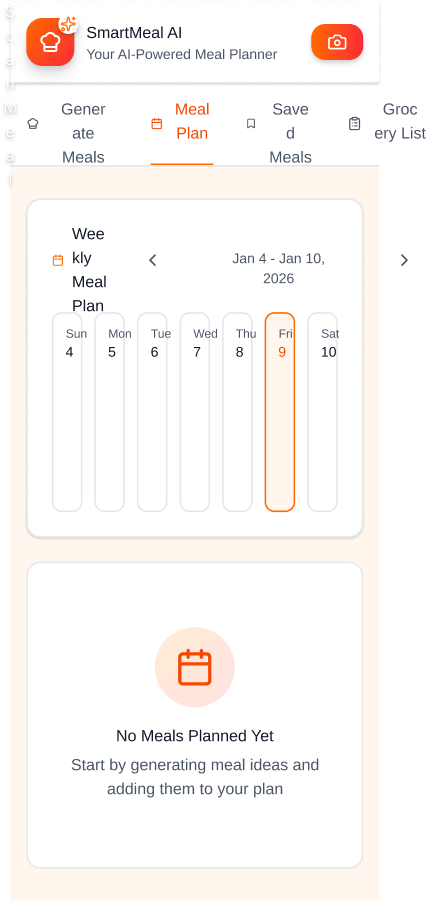
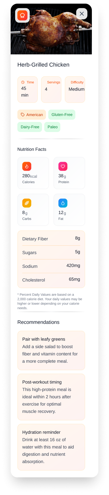
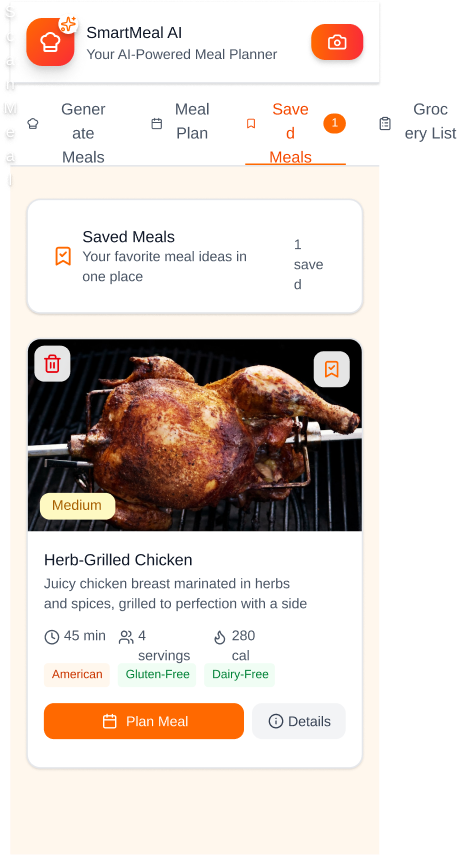
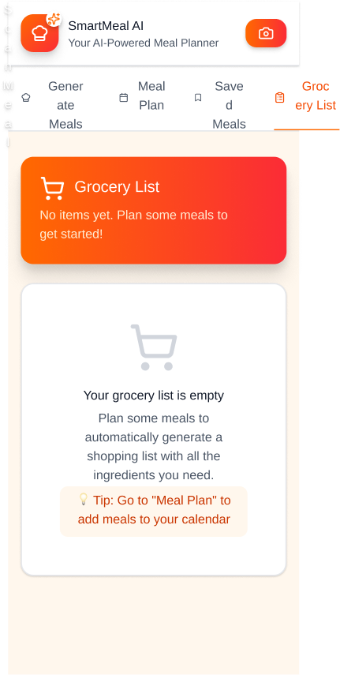

# Meals AI - Android App

An AI-powered meal planning Android application built with Kotlin, developed as a Master's degree capstone project. The app allows users to generate personalized meal recommendations using AI, build weekly meal plans, and automatically compile grocery lists.

## Features

- **AI Meal Generator** — Generate personalized meal recommendations via text input or camera-based food scan (Google Vision API)
- **Weekly Meal Planner** — Add generated meals to a weekly calendar view and manage your plan day by day
- **Meal Details** — View full recipe info, ingredients, and nutritional context for any meal
- **Saved Meals** — Bookmark and revisit favorite AI-generated recipes
- **Grocery List** — Auto-compiled shopping list based on your weekly meal plan
- **User Authentication** — Secure login and signup powered by Firebase Auth
- **Account Management** — User profile and settings backed by Firestore

## Tech Stack

| Layer | Technology |
|-------|-----------|
| Language | Kotlin |
| UI | Material Design 3, ConstraintLayout, RecyclerView |
| Navigation | Android Navigation Components |
| Auth | Firebase Authentication |
| Database | Cloud Firestore |
| AI / Vision | Google Vision API, text-based recommendation generation |
| Architecture | Fragment-based with ViewModels |
| Min SDK | API 24 (Android 7.0) |
| Target SDK | API 34 (Android 14) |

## Screenshots

| Login | Meal Generator | Weekly Plan |
|-------|---------------|-------------|
|  |  |  |

| Meal Details | Saved Meals | Grocery List |
|-------------|-------------|--------------|
|  |  |  |

### Project Structure

```
app/
├── src/
│   └── main/
│       ├── java/com/mealsai/app/
│       │   ├── LoginActivity.kt             # Login screen
│       │   ├── SignupActivity.kt            # Signup screen
│       │   ├── MainActivity.kt              # Main activity with bottom navigation
│       │   ├── WeeklyPlanFragment.kt        # Weekly meal plan
│       │   ├── SavedMealsFragment.kt        # Saved meals
│       │   ├── GroceryListFragment.kt       # Grocery list
│       │   ├── MealDetailsFragment.kt       # Meal details
│       │   └── ui/generate/
│       │       └── GenerateMealFragment.kt  # AI meal generator
│       ├── res/
│       │   ├── layout/                      # XML layouts
│       │   ├── drawable/                    # Icons and drawables
│       │   ├── values/                      # Strings, styles, etc.
│       │   └── menu/                        # Menu resources
│       └── AndroidManifest.xml
└── build.gradle                             # App-level build config
```

## Branch Strategy

Each feautre was developed in isolation and merged into `main` on completion:

| Branch | Purpose |
|--------|---------|
| **main** | Full app — source of truth |
| **feature/login-signup** | Login and sign-up UI + Firebase Auth |
| **feature/account-management** | User profile (Firestore CRUD, settings) |
| **feature/ai-capture** | Camera + food scan (Vision API) |
| **feature/recommendation-generation** | Text-based AI meal generation |
| **feature/weekly-plan** | Weekly meal plan tab |
| **feature/saved-meals-grocery** | Saved meals + grocery list tabs |

## Getting Started

### Prerequisites

- Android Studio (latest version recommended)
- Android SDK (API 24 minimum, API 34 target)
- A physical Android device with USB debugging enabled, or An Android emulator

### Running the App

1. Clone the repository and open the project folder in Android Studio
2. Let Gradle sync automatically, or trigger it via `File > Sync Project with Gradle Files`
3. Connect a device or start an emulator
4. Click the **Run ▶** button or press `Shift + F10`

### Troubleshooting

| Issue | Fix |
|-------|-----|
| Gradle sync failed | Check internet connection; try `File > Invalidate Caches / Restart` |
| Device not detected | Confirm USB debugging is on; run `adb devices` to verify |
| Build failed | Run `Build > Clean Project`, then `Build > Rebuild Project` |
| App crashes on launch | Check Logcat for errors; verify minimum SDK (API 24) is met |
